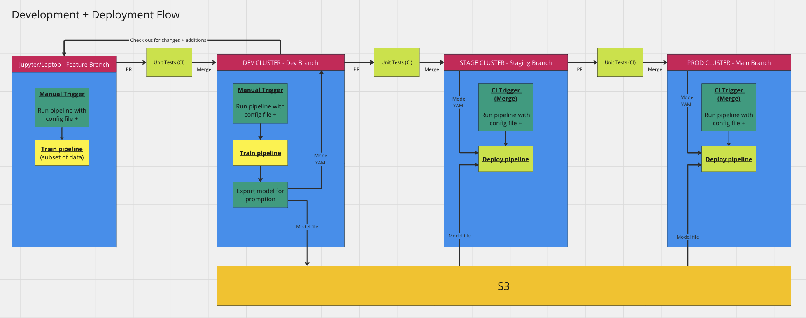
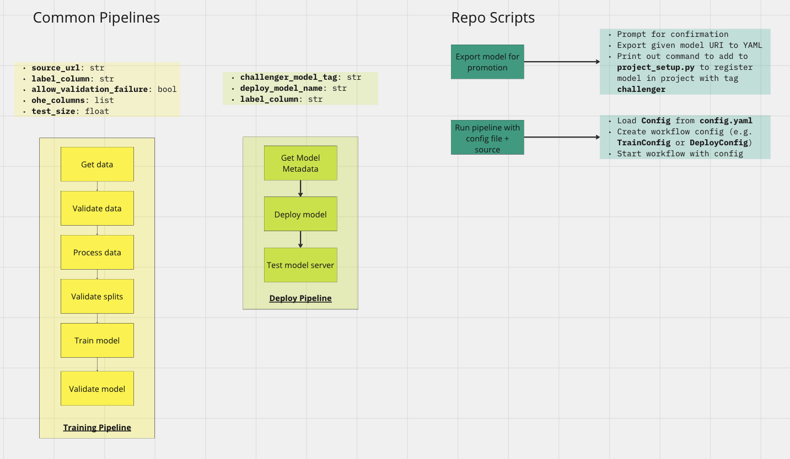
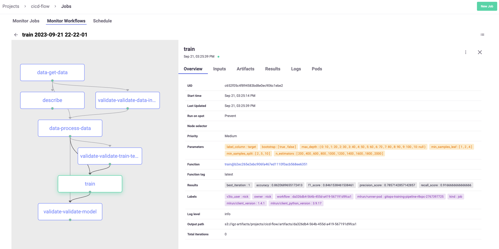
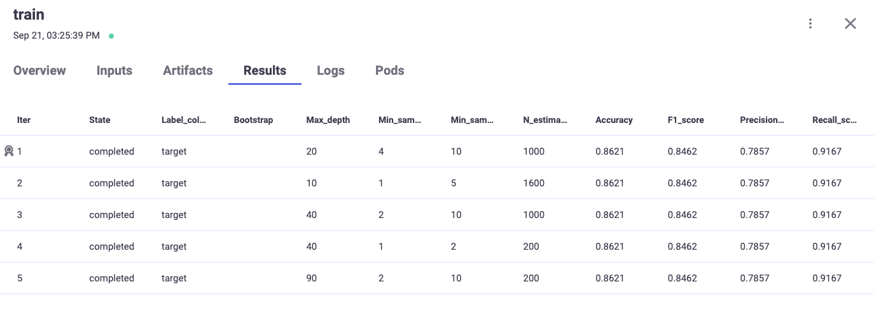
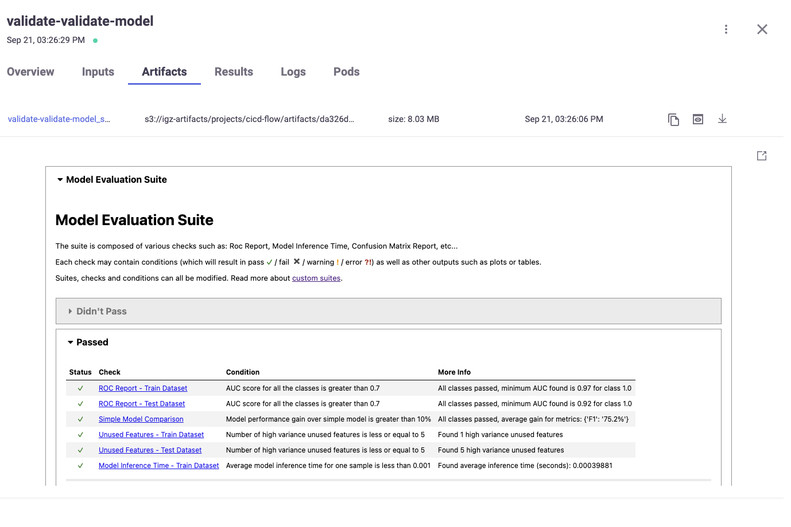
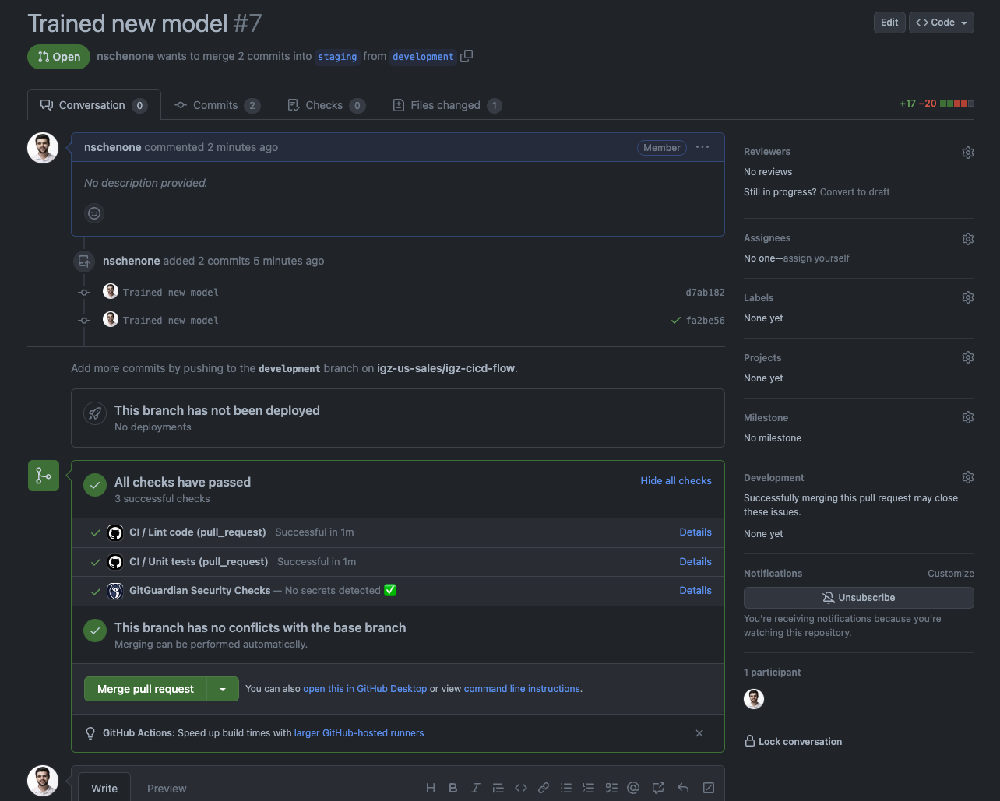
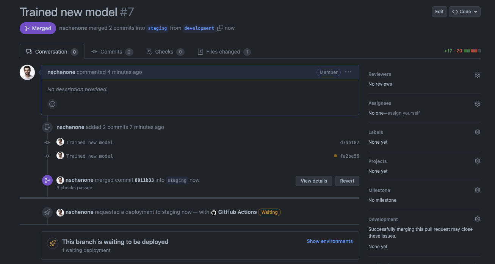
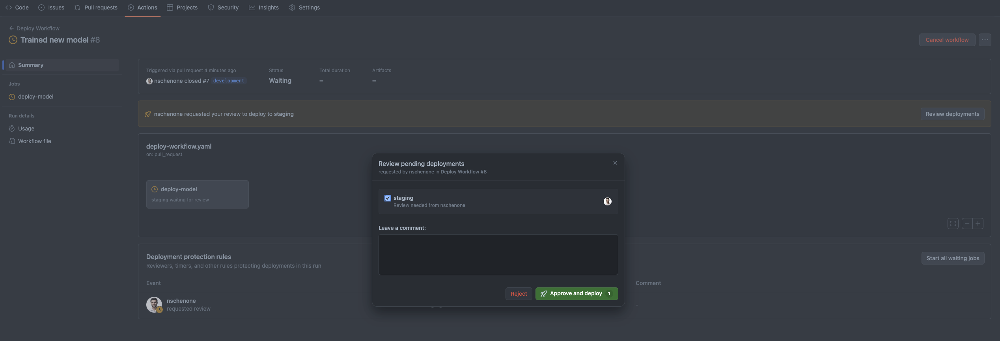
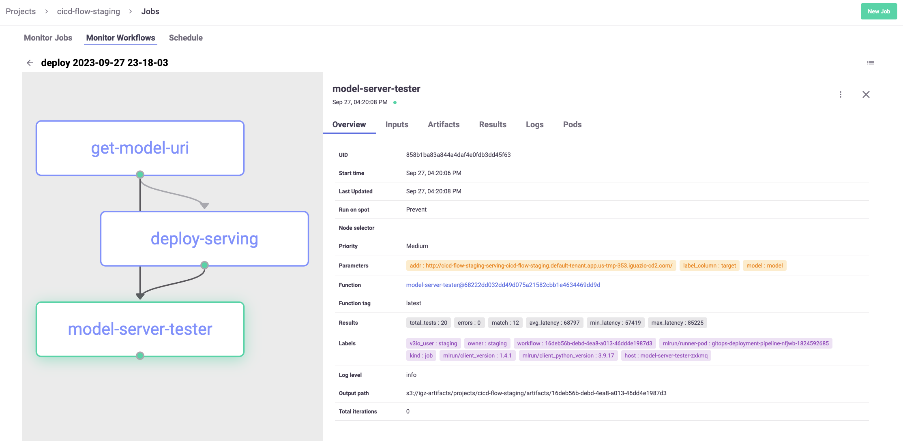
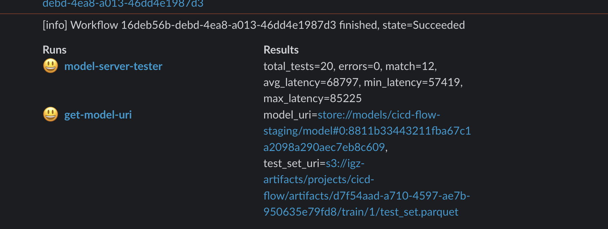

# Model Promotion from Development to Production via CI/CD

## Overview
This repo provides a comprehensive guide on promoting machine learning models from the development environment to production using a combination of the Iguazio platform, Git, and CI/CD pipelines (GitHub Actions). We will walk through the architecture of the environment, the pipelines and scripts utilized, and the step-by-step flow from development to staging and finally to production.

## Architecture of Environment and Overview of Pipelines/Scripts Used
Our model promotion process is facilitated by a robust CI/CD pipeline integrated with version control and the Iguazio platform which provides production grade containerization + pipeline orchestration, experiment tracking, logging and monitoring, and more. Here's an overview of the architecture and key components:

### Environment Architecture
- **Local Environment**: Where experimentation takes place on a developer's laptop, IDE, or Jupyter instance.
- **Development Environment (Dev)**: Where the model development and initial testing take place.
- **Staging Environment (Staging)**: Intermediate environment for rigorous testing and validation.
- **Production Environment (Production)**: The live environment where the model serves real-world requests.

This looks like the following:



### Pipelines, Scripts, Notifications, and Repo Tooling
- **Training Pipeline**: Responsible for training the machine learning model. This pipeline is triggered manually or automatically when code changes are pushed to the development branch.

- **Deployment Pipeline**: Responsible for deploying the trained model into the staging and production environments. This pipeline is triggered automatically when code changes are pushed to the development/staging branch and requres a human-in-the-loop approval step to proceed further.

- **Export Model Script**: After successful training, this script exports the trained model, making it ready for deployment.

- **Slack Notifications**: Provides real-time updates on the status of pipelines and their output artifacts + results.

This looks like the following:



Additionally, there are three CI/CD pipelines via GitHub actions:
- **Unit Tests and Linting (ci.yaml)**: Automated testing and code quality checks are performed on all branches to ensure code correctness and style compliance.
- **Submit Training Pipeline (train-workflow.yaml)**: Starts training pipeline in cluster of choice. This pipeline triggered manually, but could also be configured to run automatically as part of a re-training flow.
- **Submit Deployment Pipeline (deploy-workflow.yaml)**: Starts deployment pipeline in cluster of choice. This pipeline triggered automatically by merged pull requests in the deevlopment and staging branches.

These are located here in [.github/workflows](.github/workflows):


## Walkthrough of Flow

### Development

#### Run Training Pipeline
First, the data scientist initiates the training pipeline to train the machine learning model using the latest code and data. The training pipeline parameters are pulled from a centralized configuration file ([config.py](config.py)) and validated by [Pydantic](https://docs.pydantic.dev/1.10/) before executing via the main entrypoint script ([main.py](main.py)):

```bash
python main.py --workflow-name train
```

Under the hood, this spins up a containerized pipeline on Kubernetes - the code for which is in [train_workflow.py](src/workflows/train_workflow.py). This results in the following model training run:



This pipeline also does automated hyperparamter tuning:



It also logs robust data and model validation reports from the [Deepchecks](https://docs.deepchecks.com/stable/getting-started/welcome.html) library:



#### Export Model
After successful training, the model metadata is exported to a YAML file to be stored in version control (the model itself is stored in AWS S3 or some other globally accessible location).

First, the data scientist copies the model URI from the model registry:


Then, the model is exported by using the model export script ([export_model.py](export_model.py)). 

```bash
python export_model.py --model-uri store://models/cicd-flow/model#0:latest
```

This results in the following output:

```bash
Export model 'store://models/cicd-flow/model#0:latest' with tag 'challenger'? (yes/no): yes
Exporting model to artifacts/model:challenger.yaml...

Add the following to the `src/project_setup.py` script:

project.set_artifact(
    key="model", artifact="artifacts/model:challenger.yaml", tag="challenger"
)
```

Now, all experiment tracking and model metadata are stored in [artifacts/model:challenger.yaml](artifacts/model:challenger.yaml).

#### Git Pull Request:
Now, the data scientist can create a Git pull request to merge their code changes into the development branch:


Then, automated unit tests and code linting are performed on the development branch via CI/CD ([ci.yaml](.github/workflows/ci.yaml)) to maintain code quality:



Finally, upon successful code review and passing tests, the pull request is merged into the development branch. This will start the deployment process in the staging environment:



### Staging + Production
*Note: As the staging and production environments should be identical, the steps pertaining to them will be the same.*

#### Human in the Loop Approval
Before proceeding with deployment to the staging/production environment, a human-in-the-loop approval step is triggered:



#### Run Deployment Pipeline
Once approved, the deployment pipeline is triggered via CI/CD ([deploy-workflow.yaml](.github/workflows/deploy-workflow.yaml)):


Additionally, a Slack Notification is sent to notify the start of the pipeline:


The containerized deployment pipeline itself runs in the Iguaizo cluster - the code for which is in [deploy_workflow.py](src/workflows/deploy_workflow.py):



This results in the newly promoted model being deployed in the staging/production environment.

#### Notify

Once the pipeline completes, the GitHub action will report a success:


Also, a second Slack notification will be sent to notify the end of the pipeline:



*Note: If the pipeline fails, there will be a failure notification via Slack as well as by email*

### Promote (Staging Only)
The only difference between the staging and production environment in this flow is that staging has one extra step that promotes it to production. This will look identical to how development was promoted to staging including:
- Pull Request
- Unit tests + linting
- Merge + human in the loop
- Deployment pipeline
- Slack Notification